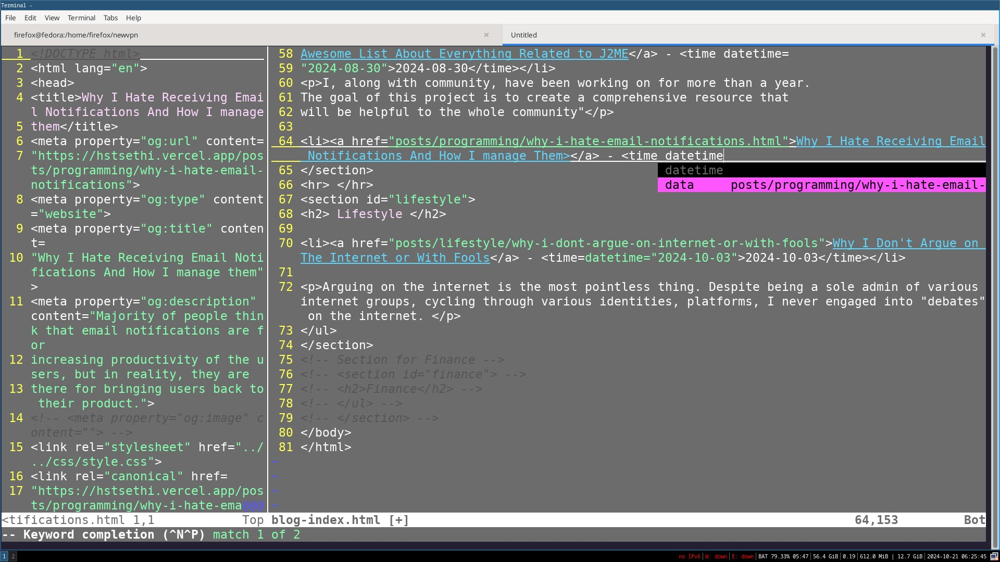
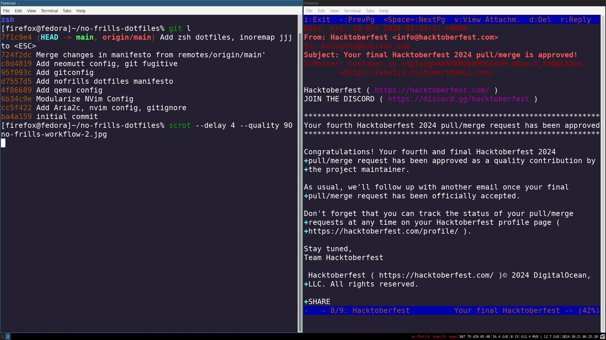

## Hstsethi's No Frills Dotfiles

This is my personal collection of dotfiles that follow the guidelines mentioned in manifesto below.

The pictures below  were randomly taken during my work. I didn't setup these programs this way just for taking screenshots. They aim to show the real picture of how my workflow is like.

## Configurations Not Available Here

- Music Player
  
    Because I don't listen to music.

- Video Player
  
    I don't watch videos. If I do, I  stick with default mpv, ffplay.

- Wallpaper Utility
- Web Browser
 
   I mostly use Librewolf with JavaScript disabled, Elinks with default configuration.

- Grub Config

  Because It is specific to machine. Instead I have provided grub template which I use with `grub2-mkconfig`. It sets max cpu to 4, disables framebuffer and splash screen.

- Image Editor

   I mostly use Imagemagick from command line for cropping, chopping, resizing. I just guess the required chop size and it often works. For trivial tasks, I use Gimp.

  See my `crop-sc-status-nav-bar.sh` script in `privacy-scripts` folder for a practical example.

  Though, this usually has to be done only with mobile screenshots, as on desktop, I use combination of I3 shortcuts, Dmenu, Maim to take cropped screenshots, and save them with  ISO 8601 formatted date followed by input variable collected through Dmenu.  The shortcut is `$Mod1 + Shift + s`.

- Navigation Software
  
    I use Organic Maps, and a simple compass, on both Android and Desktop. I scrap important place's coordinates from Google maps and then **locally** bookmark them, export them to KML.

    My mobile doesn't have a precise GPS due to it being debloated. Though, I do not need to use map much. In case map isn't available, I also have knowledge of primitive methods of navigation including constellations, [stick and shadow method](https://res.cloudinary.com/dkgunni5p/image/upload/primitve-compass-ground_f93fb1.jpg).

- UFW 

    I used it in past, but it was too slow for my use-case. I have, since age 17, switched to Iptables script, `iptables-ovpn-kill-switch.sh`, that automatically extracts all ips, ports from openvpn config file. It then blocks all connections except from those ips and only from specific users: root, firefox. There is an another user called `nonet` which I use to run commands without internet.

## No Frills Dotfiles Manifesto

- Efficiency, time savings over aesthetic.
- Don't fix it until it's broken. Don't customize unless required.
- Document everything. Explain what did you do and why.
- Keyboard over mouse.
- Machine Readability

 Configuration files must be machine readable. However this rule can be extended to various other scenarios including function documentation, personal notes in markdown. 
 
For an example of such, see my  [Structured List Md](https://github.com/hstsethi/structured-list-md) project. Which is a  specification, scripts for authoring structured, machine readable lists in plain Markdown by leveraging HTML. The readme of this project, what you are reading right now, also implements this.
